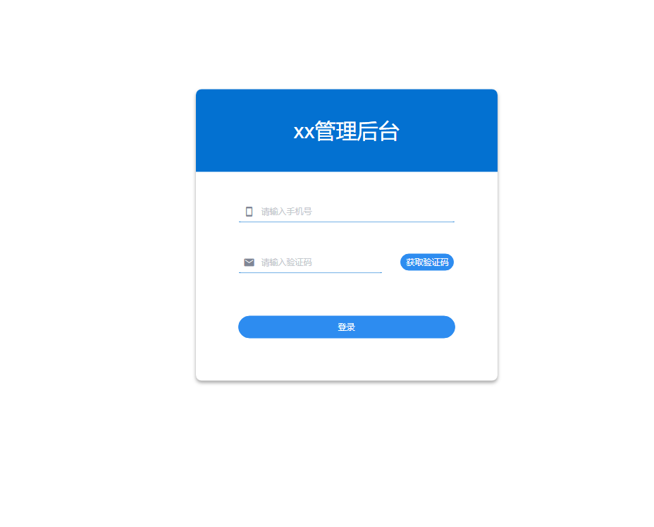
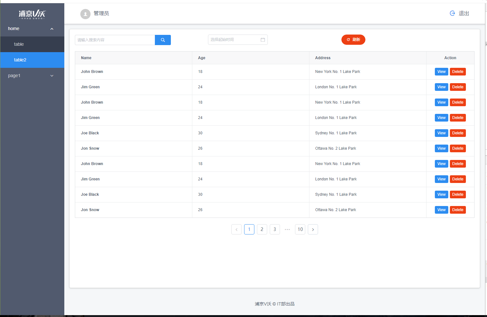

#### 项目说明
     vue前端路由权限控制后台登录，主页基础模板
     登录账号密码输入任意值

## Project setup
```
npm install
```

### Compiles and hot-reloads for development
```
npm run serve
```

### Compiles and minifies for production
```
npm run build
```
### 项目截图
 
 

### 目录结构
```
├─public
│      favicon.ico 
│      index.html	
│
└─src
    │  App.vue
    │  main.js
    │
    ├─api	//接口
    │      index.js
    │      user.js
    │
    ├─assets //静态资源
    │  ├─font
    │  └─img
    │          logo.png
    │
    ├─components	//组件
    │  ├─k-header
    │  │      index.vue
    │  │
    │  └─k-submenu
    │          index.vue
    │
    ├─config	//全局配置
    │      index.js
    │
    ├─lib	//工具
    │      axios.js	//封装axios
    │      tools.js
    │      util.js
    │
    ├─mock	//mock拦截配置
    │  │  index.js
    │  │
    │  └─response
    │          user.js
    │
    ├─router	//路由
    │      index.js	//路由权限控制
    │      router.js
    │
    ├─store   //vux 
    │  │  actions.js
    │  │  index.js
    │  │  mutations.js
    │  │  state.js
    │  │
    │  ├─module
    │  │      router.js	// 动态路由添加
    │  │      user.js
    │  │
    │  └─plugin
    │          savaInLocalS.js //vux 本地持久化
    │
    └─views	//页面
            Error_404.vue
            IndexTable.vue
            Layout.vue
            Login.vue
```

